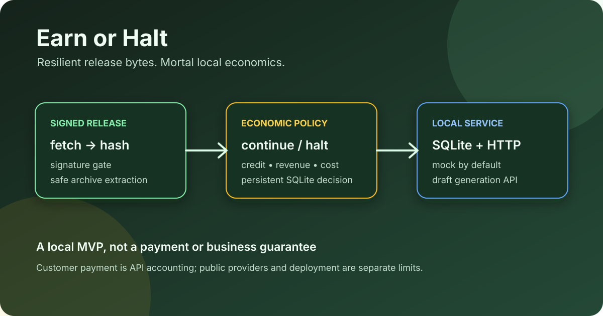

# Earn or Halt

[Docs](docs/) · [API](docs/API.md) · [Test report](docs/TEST_REPORT.md) · [Security](SECURITY.md) · [Upstream](https://github.com/meanwebuser/earn-or-halt)

> Run a small service worker that records its economics, persists a halt decision, and verifies signed release bytes before resurrection.

Earn or Halt is a dependency-free Python MVP for B2B draft generation. It
combines a SQLite queue and ledger with an economic policy and a separate
release bootstrap. The default provider is deterministic mock mode.

## What it provides

- A policy check for available credit, margin, daily cost, failures and idle
  cycles before work continues.
- SQLite jobs, ledger stats, runtime state and persistent operator halt.
- Mock or OpenAI-compatible draft generation through a small HTTP API.
- SHA-256/signature verification and safe extraction for signed release
  archives.

## Verify from a clean machine

This download-inclusive command creates an isolated Python 3.11 environment,
installs the local package, and reaches the unit tests and signed local smoke
path from an empty directory:

~~~
git clone --depth 1 https://github.com/meanwebuser/earn-or-halt.git &&
cd earn-or-halt &&
python3.11 -m venv .venv &&
. .venv/bin/activate &&
python3 -m pip install -e . &&
PYTHONDONTWRITEBYTECODE=1 python3 -m unittest discover -s tests -v &&
PYTHONDONTWRITEBYTECODE=1 ./scripts/smoke-test.sh
~~~

## Start locally

The tracked example is the mock-safe starting point:

~~~
python3.11 -m venv .venv
. .venv/bin/activate
python3 -m pip install -e .
cp .env.example .env
set -a
. ./.env
set +a
python3 -m earn_or_halt run
~~~

Then use the documented HTTP API. Set EOH_API_TOKEN before exposing it beyond
a trusted local network.

## Limits

Revenue entered through the API is local accounting, not an independently
signed customer payment. The project does not send email, provide payment
settlement, or guarantee public IPFS/Ethereum/Docker deployment. See
[docs/PHILOSOPHY.md](docs/PHILOSOPHY.md),
[docs/PROOFS.md](docs/PROOFS.md) and
[docs/TEST_REPORT.md](docs/TEST_REPORT.md).
